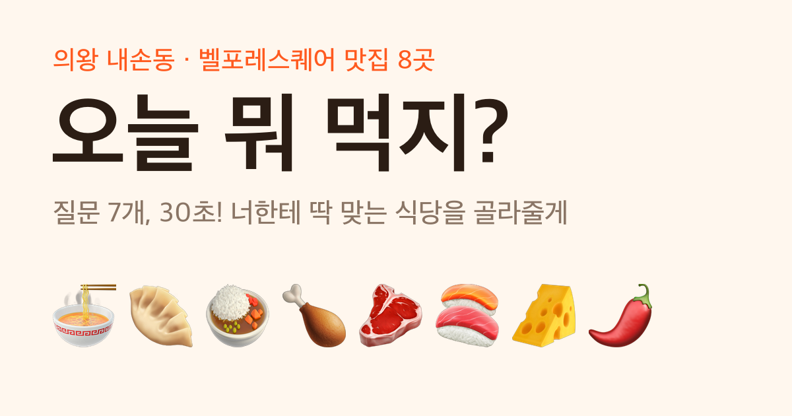
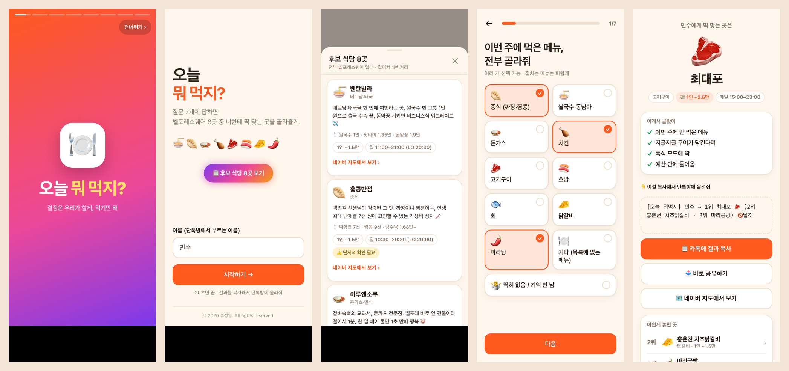

<div align="center">

<a href="https://passionryu.github.io/oneul-mwomeokji/"></a>

# 🍽️ 오늘 뭐 먹지?

### "아무거나"는 이제 그만. 질문 7개, 30초면 오늘 갈 식당이 정해집니다.

<a href="https://passionryu.github.io/oneul-mwomeokji/"></a>


</div>

---

## 😩 이런 단톡방, 익숙하지 않나요?

> **A:** 오늘 뭐 먹을래?
> **B:** 아무거나~
> **C:** 난 다 좋아
> **D:** 어제 중식 먹었는데…
> **A:** (30분째 결정 못 함)

8명이 모이면 메뉴 하나 정하는 데 한참 걸립니다. 누구는 이번 주에 치킨을 두 번 먹었고, 누구는 회를 못 먹고, 누구는 오늘 지갑이 가볍습니다. **이걸 다 기억하고 조율하는 건 주최자 몫**이었죠.

**「오늘 뭐 먹지?」는 그 30분을 30초로 줄여 드립니다.**

---

## ✨ 한눈에 보기

<div align="center">

<br>
<sub>시작 화면 → 후보 식당 목록 → 질문 → 나만의 추천 결과</sub>
</div>

---

## 🔥 왜 「오늘 뭐 먹지?」인가

| | 기능 | 이게 왜 좋냐면 |
|:-:|---|---|
| 🔁 | **이번 주 메뉴 중복 방지** | 월요일에 짬뽕, 수요일에 짜장을 먹은 친구에게 또 중식을 권하지 않습니다 |
| 🚫 | **못 먹는 음식은 자동 제외** | 날것을 못 먹는 친구가 한 명이라도 있으면 초밥·회는 후보에서 바로 빠집니다 |
| 💸 | **예산 맞춤** | "오늘은 1.5만 원 이하"라고 하면 비싼 곳은 뒤로 밀립니다 |
| 🧠 | **이유까지 설명** | "이번 주에 안 먹은 메뉴 ✓ 지글지글 구이가 당긴다며 ✓"처럼 왜 추천했는지 알려줍니다 |
| 📋 | **카톡 복사 한 번** | 결과가 한 줄 메시지로 정리돼서 단톡방에 바로 붙여넣으면 끝 |
| 🗺️ | **네이버 지도 바로가기** | 추천받은 식당의 메뉴, 사진, 길찾기를 한 번에 확인 |
| 📱 | **폰에 최적화** | 카톡 인앱 브라우저에서 바로 열리고, 다크모드도 지원합니다 |
| 🔒 | **개인정보 수집 없음** | 서버도 DB도 없습니다. 답변은 친구 폰 밖으로 나가지 않습니다 |

---

## 🚀 사용법: 딱 3단계

```
 ① 주최자가 링크를 단톡방에 공유
        ↓
 ② 친구들이 각자 폰에서 질문 7개에 답하기 (30초)
        ↓
 ③ 결과를 복사해서 단톡방에 붙여넣기 → 주최자가 보고 최종 결정!
```

단톡방은 이런 모습이 됩니다.

```
민수: [오늘 뭐먹지] 민수 → 1위 최대포 🥩 (2위 홍춘천 치즈닭갈비 · 3위 벤탄빌라) 🚫날것
지은: [오늘 뭐먹지] 지은 → 1위 벤탄빌라 🍜 (2위 하루엔소쿠 · 3위 홍콩반점)
철수: [오늘 뭐먹지] 철수 → 1위 최대포 🥩 (2위 보드람치킨 · 3위 벤탄빌라)
```

### 🧑‍✈️ 주최자용 결정 공식

1. **🚫가 붙은 식당은 제외** (한 명이라도 못 먹으면 빼기)
2. **1위 표가 가장 많은 곳**으로 결정
3. 동점이면 **2·3위에 더 많이 나온 곳**으로 결정

위 예시라면 🚫날것 때문에 초밥·회는 빠지고, **최대포 2표**로 결정입니다. 🥩

---

## 🍴 후보 식당 라인업 (9곳)

전부 의왕 내손동 **벨포레스퀘어 일대**에 모여 있어서 걸어서 1분이면 갑니다. 앱 첫 화면의 **📋 후보 식당 9곳 보기** 버튼으로도 볼 수 있습니다.

| | 식당 | 종류 | 1인 예산 | 대표 메뉴 |
|:-:|---|---|:-:|---|
| 🍜 | [벤탄빌라 의왕내손점](https://m.place.naver.com/restaurant/1718113572/home) | 베트남·태국 | ~1.5만 | 쌀국수 1만 · 팟타이 1.35만 |
| 🥟 | [홍콩반점0410 의왕내손점](https://m.place.naver.com/restaurant/1899397279/home) | 중식 | ~1.5만 | 짜장면 7천 · 짬뽕 9천 |
| 🍛 | [하루엔소쿠 의왕내손점](https://m.place.naver.com/restaurant/35905708/home) | 돈카츠·일식 | ~1.5만 | 로스카츠 1.15만 |
| 🍗 | [보드람치킨 내손점](https://m.place.naver.com/restaurant/2076098783/home) | 치킨 | ~1.5만 | 후라이드 2.2만 |
| 🧀 | [홍춘천 치즈닭갈비](https://m.place.naver.com/restaurant/1282785816/home) | 닭갈비 | ~1.5만 | 치즈닭갈비 1.5만 |
| 🌶️ | [마라공방 의왕내손점](https://m.place.naver.com/restaurant/1349943901/home) | 마라탕·샹궈 | ~1.5만 | 마라탕 100g 2천 |
| 🥩 | [최대포](https://m.place.naver.com/restaurant/21151799/home) | 고기구이 | ~2.5만 💸 | 갈매기살·항정살 1.6만 |
| 🍣 | [파도초밥](https://m.place.naver.com/restaurant/1197859862/home) | 초밥 | ~2.5만 💸 | 초밥 코스 2.2만 |
| 🐟 | [신안수산 2호점](https://m.place.naver.com/restaurant/19048520/home) | 활어회 | 3만+ 💸 | 모듬회 8만~ (여럿이 나눠 먹기) |

<sub>※ 가격과 영업시간은 2026년 9월 네이버 플레이스 기준입니다. 방문 전에 한 번 더 확인해 주세요.</sub>

---

## 🧠 추천은 이렇게 계산됩니다

모든 식당이 **0점에서 출발**해서, 답변 하나하나가 점수를 더하거나 뺍니다.

| 질문 | 점수 규칙 |
|---|---|
| 1. 이번 주에 먹은 메뉴 | 먹은 메뉴의 식당 **−4점** |
| 2. 못 먹는 것 | 날것 → 초밥·회 **🚫제외** / 매운 것 → 마라탕 🚫, 닭갈비·중식 감점 |
| 3. 끌리는 식감 | 국물·구이·튀김·철판·날것 중 맞는 곳 **+3점** |
| 4. 배고픈 정도 | 가볍게 vs 폭식 모드에 맞는 곳 **+2점** |
| 5. 예산 | 예산을 넘는 곳 **−3~−5점**, "상관없어"면 비싼 곳 가산점 |
| 6. 식후 계획 | 빨리 2차 vs 오래 수다에 맞는 곳 **+2점** |
| 7. 오늘의 기분 | 분위기 보너스 **+1점** |

### 📊 공정성 검증 완료

가능한 답변 조합 **약 34만 가지를 전부 시뮬레이션**해서, 특정 식당이 1위를 독식하지 않는지 확인했습니다. (못 먹는 것 없음, 이번 주 먹은 메뉴 0~2개 기준)

```
최대포            ███████████████▋  15.7%
보드람치킨         ██████████████▎   14.3%
홍춘천 치즈닭갈비   █████████████▋    13.7%
마라공방          █████████████▌    13.5%
하루엔소쿠         ████████████▎     12.3%
벤탄빌라          ███████████▊      11.8%
홍콩반점          ███████▎           7.3%
파도초밥          █████▉             5.9%
신안수산          █████▌             5.5%
```

**9곳 모두 1위가 될 수 있습니다.** 파도초밥과 신안수산은 비싼 곳이라 일부러 덜 나오게 했고, "예산 상관없어"를 고르면 순위가 올라갑니다.

---

## 🛠️ 기술 스택

<div align="center">


</div>

- **프레임워크, 빌드, 서버, DB 없음.** 파일 3개(`index.html`, `core.js`, `og.png`)가 전부입니다.
- **카톡 인앱 브라우저 대응**: 복사 버튼은 Clipboard API → `execCommand` → "길게 눌러 복사" 안내 순서로 3단계 대비책을 둡니다.
- **모바일 최적화**: `100dvh`, 아이폰 하단 안전영역, 52px 이상의 큰 터치 영역, 다크모드 자동 전환
- **카톡 링크 미리보기**: Open Graph 태그와 전용 썸네일 이미지

```
oneul-mwomeokji/
├── index.html   # 화면 · 스타일 · UI 로직
├── core.js      # 식당 데이터 · 질문 · 추천 알고리즘 (Node에서도 실행 가능)
├── og.png       # 카톡 링크 미리보기 이미지
└── docs/        # README용 스크린샷
```

### 식당을 추가하거나 바꾸려면?

`core.js`의 `RESTAURANTS` 배열에 한 줄만 추가하면 됩니다. 로직은 건드릴 필요가 없습니다.

```js
{ id: "new", name: "새 식당", emoji: "🍝", kind: "파스타", price: 1,
  hours: "매일 11:00–22:00", menu: "알리오올리오 1.2만", url: "https://m.place.naver.com/..." },
```

그다음 `QUESTIONS`의 각 선택지 `score`에 `new: 3`처럼 점수를 넣어 주면 추천 후보에 들어갑니다.

---

## ❓ 자주 묻는 질문

<details>
<summary><b>친구들 답변이 어딘가에 저장되나요?</b></summary>
<br>
아니요. 서버와 DB가 없어서 모든 계산이 각자의 폰 안에서 끝납니다. 기기에 남는 건 다음에 이름을 다시 입력하지 않도록 저장하는 이름 하나뿐입니다.
</details>

<details>
<summary><b>복사 버튼을 눌러도 복사가 안 돼요</b></summary>
<br>
일부 인앱 브라우저는 자동 복사를 막습니다. 그럴 때는 화면에 "길게 눌러서 복사해줘" 안내가 뜨니, 점선 박스 안의 글자를 길게 눌러 복사해 주세요.
</details>

<details>
<summary><b>같은 답을 해도 결과가 가끔 달라요</b></summary>
<br>
점수가 완전히 같은 식당끼리는 가격이 싼 곳이 먼저 오고, 그래도 같으면 랜덤으로 정합니다. 매번 똑같으면 재미없으니까요. 😉
</details>

<details>
<summary><b>홍콩반점·닭갈비·마라공방에 ⚠️ 표시가 붙어요</b></summary>
<br>
네이버 플레이스에 단체석·예약 정보가 없는 곳입니다. 8명이 한 번에 앉을 수 있는지 미리 전화로 확인하는 걸 추천합니다.
</details>

---

<div align="center">

### 🍽️ 오늘 저녁 메뉴, 더 이상 고민하지 마세요.

<a href="https://passionryu.github.io/oneul-mwomeokji/"></a>

<sub>Made with 🧡 for 새중앙교회 친구들 · Built with <a href="https://claude.com/claude-code">Claude Code</a></sub>

</div>
